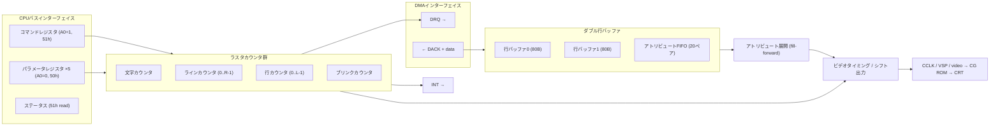
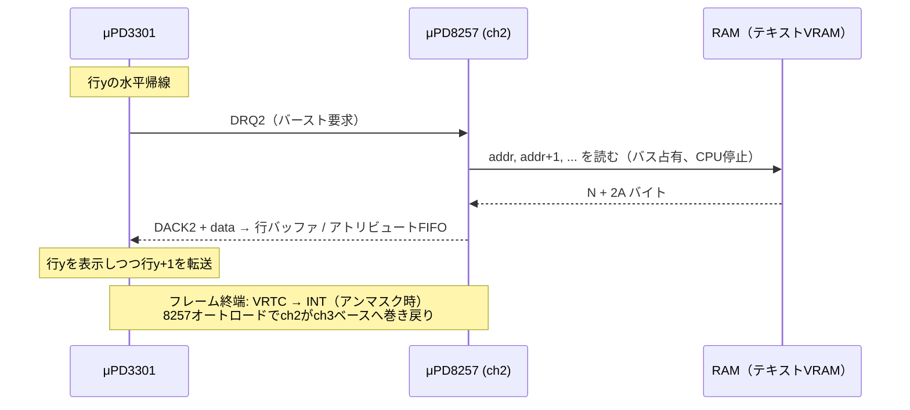
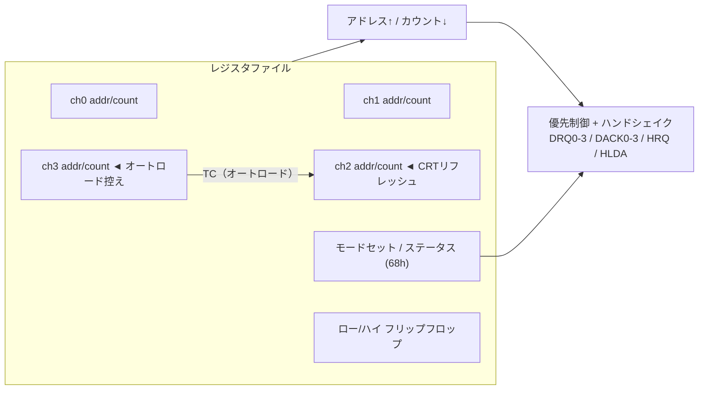

[English](./datasheet.md) · **日本語**

```
┌────────────────────────────────────────────────────────────────────┐
│  N E C   E L E C T R O N I C S                （エミュレータ再現版）│
│                                                                    │
│   μPD3301  プログラマブル CRT コントローラ                          │
│   μPD8257  プログラマブル DMA コントローラ                          │
│                                                                    │
│   技術資料 — 本リポジトリの実装仕様                          Rev.EX │
└────────────────────────────────────────────────────────────────────┘
```

*70年代末のデータブック風に整形。忠実な値の出典はREADMEの参考資料。
**EX** 印は本リポジトリの架空シリコン改版で、実在のNEC製品ではない。*

---

# μPD3301 — プログラマブル CRT コントローラ

## 特長

- ラスタスキャンCRT用キャラクタ表示コントローラ。2〜80文字 × 1〜64行、
  文字行あたり1〜16走査線
- **自前のメモリを持たない** — 表示データはDMAで取得（μPD8257と
  DRQ/DACKハンドシェイク）。水平帰線中に1文字行ぶんをバースト転送：
  `N文字 + 2×A アトリビュートバイト`（A最大20）
- ダブル行バッファ：一方を表示中にもう一方へDMA充填
- アトリビュート方式：（位置, 値）ペア、fill-forward展開
- プログラマブルカーソル（下線/ブロック × 点滅/固定）、ブリンク時基
- VRTCフレーム終端割り込み、DMAアンダーラン検出
- ライトペンレジスタ（本エミュレータでは未対応）

## ブロック図



このチップが出すのは*文字コードとタイミング*であってピクセルではない。
キャラクタジェネレータROMはチップの外、シフト出力とCRTの間にいる。
本エミュレータではCGROMは注入式の `Uint8Array(256×16)`。

## I/Oマップ（PC-8001）

| ポート | R/W | 機能 |
|------|-----|----------|
| 50h | W | パラメータ書き込み（RESET後5バイト、LOAD CURSOR後2バイト） |
| 50h | R | パラメータ読み出し（ライトペン） |
| 51h | W | コマンド |
| 51h | R | ステータス |

## コマンド一覧（bit 7–5 で選択）

| コード | コマンド | 後続パラメータ |
|------|---------|---------------------|
| 000x_xxxx | RESET — 表示停止、パラメータ待ち | 5バイト（下表） |
| 001x_xxxV | START DISPLAY — V: 画面反転 | — |
| 010x_xxNM | SET INTERRUPT MASK — M: VRTCマスク、N: 特殊文字マスク | — |
| 011x_xxxx | READ LIGHT PEN | 2バイト読み返し |
| 100x_xxxC | LOAD CURSOR POSITION — C: カーソル表示 | 2バイト: X, Y |
| 101x_xxxx | RESET INTERRUPT | — |
| 110x_xxxx | RESET COUNTERS | — |

## RESETパラメータ（5バイト）

| # | ビット | 意味 |
|---|------|---------|
| 1 | `D......` | D: DMAモード（1 = バースト） |
| 1 | `.HHHHHHH` | 1行の文字数 = H + 2（≤ 80） |
| 2 | `BB......` | カーソルブリンク周期 = (B+1) × 16フレーム |
| 2 | `..LLLLLL` | 表示行数 = L + 1（≤ 64） |
| 3 | `S.......` | S: スキップライン（1ラインおき表示） |
| 3 | `.CC.....` | カーソルモード: 00 点滅下線 / 01 点滅ブロック / 10 固定下線 / 11 固定ブロック |
| 3 | `...RRRRR` | 文字行あたり走査線数 = R + 1（≤ 16） |
| 4 | `VVV.....` | 垂直帰線 = V + 1 文字行 |
| 4 | `...ZZZZZ` | 水平帰線 = Z + 2 文字時間 |
| 5 | `MMM.....` | アトリビュートモード（AT1 AT0 SC）。001 = アトリビュートなし |
| 5 | `...AAAAA` | 1行のアトリビュートペア数 = A + 1（≤ 20） |

## ステータスレジスタ

| Bit | 名前 | 意味 |
|-----|------|---------|
| 7 | — | 非公開。通常1、DMAアンダーランで0に落ちる |
| 4 | VE | 表示中（START DISPLAY発行済み） |
| 3 | U | DMAアンダーラン（行のバイト数不足） |
| 2 | N | 特殊制御文字（未対応） |
| 1 | E | フレーム終端（VRTC）— アンマスク時にセット、読み出しでクリア |
| 0 | LP | ライトペンラッチ（未対応） |

## アトリビュートデータ形式（PC-8001配線）

各行のDMAブロック＝ `N文字コード` + `A ×（位置, 値）ペア`。
値バイトはbit 3で二系統に分かれ、各系統は自分の位置以降の
「状態」を別々に更新する（色を変えても反転/点滅は解除されない）：

```
カラー指定 (bit3=1): G R B S 1 x x x    S: セミグラフィックセル
機能指定   (bit3=0): g . L U . V B H    g: セミグラ（白黒モード）
                                        L: 下線  U: 上線
                                        V: 反転  B: 点滅  H: シークレット
```

色インデックス＝GRB（0黒, 1青, 2赤, 3紫, 4緑, 5水, 6黄, 7白）。
セミグラフィックセルは文字バイトを2×4ブロックのビットマップとして
再解釈：bit 0–3が左列上→下、bit 4–7が右列。

展開規則（実機の観測挙動）：値kは自分の位置から次のペアの位置まで
充填。先頭ペアは0桁目まで遡って充填。最後の値は行末まで。2ペア目
以降の `(0, 0)` はパディングでリスト終端。

## DMA動作



PC-8001の1フレーム（80×25）：25行 × 120バイト = 3000バイト/フレーム。
ターミナルカウントは `8000h + 2999`（readモード）。転送中CPUはバスから
締め出される — 有名なPC-8001の速度低下（約3割）の正体。

## タイミング

- フレーム: `(L + V) × R` 走査線 × フレームレート
- 水平偏向: `hsync = frameHz × (L + V) × R`
  — N-BASIC 80×25: 60 × (25+7) × 8 = **15 360 Hz**（あの音）
- 本エミュレータはフレーム粒度：1フレームぶんの行DMAを `stepFrame()`
  内で行順に実行。ドットクロックなし。

---

# μPD8257 — プログラマブル DMA コントローラ

## 特長

- 独立4チャネル。各16ビットアドレス + 14ビットターミナルカウント
- チャネルごとのモード: verify / write / read（カウントレジスタ上位2bit）
- 共有ロー/ハイ フリップフロップによるバイトペア書き込み
- チャネル別TCステータス、TCストップ、回転優先（未モデル化）
- **オートロード**: TCでch2がch3から再装填 — CPU介在ゼロで画面
  リフレッシュを永久に繰り返す

## ブロック図



## I/Oマップ（PC-8001: 60h–68h）

| ポート | 機能 |
|------|----------|
| 60h/61h | ch0 アドレス / ターミナルカウント |
| 62h/63h | ch1 アドレス / ターミナルカウント |
| 64h/65h | **ch2 アドレス / ターミナルカウント — CRTリフレッシュ** |
| 66h/67h | ch3 アドレス / ターミナルカウント（オートロード控え） |
| 68h | W: モードセット / R: ステータス（TCフラグ、読み出しでクリア） |

ターミナルカウントレジスタ: `MM CCCCCC CCCCCCCC` — MM: 00 verify,
01 write, 10 read。C: バイト数 − 1。モードレジスタ: bit 0–3 チャネル
イネーブル、bit 6 TCストップ、bit 7 オートロード。

## 既知の技（文書化済み・テスト済み）

| DMAカウント | 効果 |
|-----------|--------|
| 8000h + 2999 | 通常の80×25リフレッシュ |
| 8000h + 5999 | 2画面交互 → ちらつき混色27色（ベーマガ1990-07） |
| 8000h + 8999 | 3画面交互 → RGBプレーン、ドット単位カラー（1/3デューティ） |

---

# EXモード（本リポジトリの架空改版）

NEC製ではない。`Upd3301.resetEx()` と `Upd8257.setChannelEx()` がポート
エンコーディングの制限を迂回する：任意の桁×行、セル単位密度までの
アトリビュートペア、14ビット超のDMAカウント。ANSIエスケープシーケンスを
アトリビュートペアにコンパイルするターミナル層（`term.js`）のための拡張。
実機の制約（80×25、20ペア/行、14ビットカウント）が既定であり正史。

---

# 付録 — 蛍光体「Pナンバー」

デモの蛍光体ボタン（P22 / P39 / P7）の出どころは、米EIAの蛍光体登録番号。
米業界（RETMA→EIA、のちに世界共通のWTDS体系へ統合）が管面蛍光体を
**化学組成ではなく「色と残光特性」で**登録していた。「P」は単に
*Phosphor* の P。

| 番号 | 色 | 残光 | 主な用途 |
|-----|-------|-------------|-------------|
| P1 | 緑 | 中 | 初期のレーダー・オシロスコープ |
| P4 | 白 | 短 | 白黒テレビ |
| **P7** | **青白閃光→黄緑の尾** | 二層! | レーダー — 掃引の軌跡が残る |
| **P22** | RGB三色セット | 短 | カラーテレビ全部これ |
| P31 | 緑 | 短め | オシロスコープ、緑モニタ |
| **P39** | 緑 | 長 | レーダー、ベクタースキャン端末 |

覚えておきたい話：

- **P7は物理的に二層塗り。** 電子銃側に短残光の青（ZnS:Ag）、ガラス側に
  長残光の黄緑（ZnCdS:Cu）が塗られていて、青の閃光が黄緑層を励起する。
  だからレーダーの掃引線は青白く、通り過ぎた跡が黄緑に数秒光って残る。
  `crt.js` はこれを `tailPrimaries`（残光だけ別の発光色）でモデル化している。
- **P22は単一の蛍光体じゃなくて三色セットの総称** — 赤（Y₂O₂S:Eu）・
  緑（ZnS:Cu,Au）・青（ZnS:Ag）。減衰時間が色ごとに違い、青が最速で
  赤が最遅。カラー管で白の残像がオレンジに変色して消えるのはこのため。
  `crt.js` はガン別の時定数で再現している。
- **P39** は端末時代の目に優しい長残光グリーン。80年代前半のカタログに
  「P39管採用」と書かれていたやつ。
- `crt.js` の定数はオーダーが合う程度の正直さで、60Hzフレーム粒度で
  性格が見えるようにチューニングしたもの（測色データではない）。
  「長残光カラー」プリセットは架空 — 長残光の*カラー*管は実質存在しない
  （一番近い実在はP7の二層技で、あれはほぼモノクロ）。
