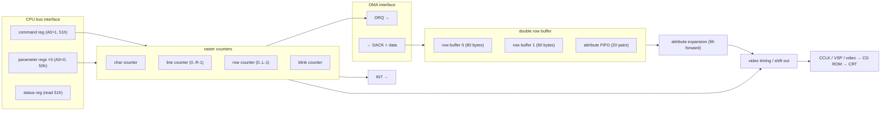
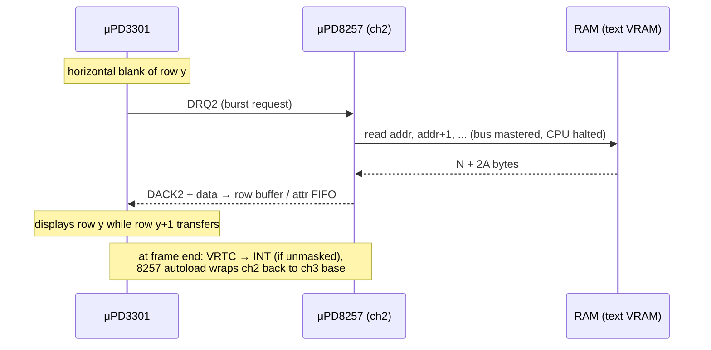
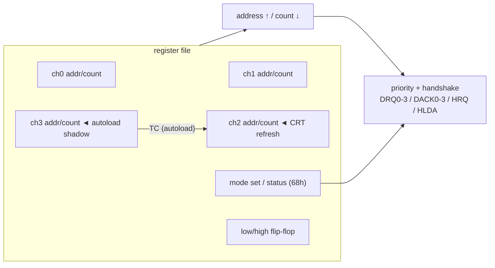

**English** · [日本語](./datasheet.ja.md)

```
┌────────────────────────────────────────────────────────────────────┐
│  N E C   E L E C T R O N I C S            (emulator reproduction)  │
│                                                                    │
│   μPD3301  PROGRAMMABLE CRT CONTROLLER                             │
│   μPD8257  PROGRAMMABLE DMA CONTROLLER                             │
│                                                                    │
│   TECHNICAL DATA — as implemented by this repository        Rev.EX │
└────────────────────────────────────────────────────────────────────┘
```

*Styled after late-70s databook sheets. Faithful values come from the
references in the README; anything marked **EX** is this repo's fantasy
silicon revision, not real NEC hardware.*

---

# μPD3301 — PROGRAMMABLE CRT CONTROLLER

## FEATURES

- Character display controller for raster-scan CRT, 2–80 characters × 1–64
  rows, 1–16 scanlines per character row
- **No memory of its own** — fetches display data over DMA (DRQ/DACK
  handshake with μPD8257), one burst per character row during horizontal
  blanking: `N chars + 2×A attribute bytes` (max A = 20)
- Double row buffer: displays one row while DMA fills the other
- Attribute system: (position, value) pairs, expanded fill-forward
- Programmable cursor (underline/block × blink/steady), blink timebase
- VRTC end-of-frame interrupt, DMA-underrun detection
- Light pen registers (not supported by this emulator)

## BLOCK DIAGRAM



The chip emits *character codes and timing*, not pixels: the character
generator ROM sits outside, between the shift-out stage and the CRT. In this
emulator the CGROM is an injected `Uint8Array(256×16)`.

## I/O MAP (PC-8001)

| Port | R/W | Function |
|------|-----|----------|
| 50h | W | parameter write (5 bytes after RESET; 2 after LOAD CURSOR) |
| 50h | R | parameter read (light pen) |
| 51h | W | command |
| 51h | R | status |

## COMMAND SET (bits 7–5 select)

| Code | Command | Trailing parameters |
|------|---------|---------------------|
| 000x_xxxx | RESET — display off, expect params | 5 bytes (below) |
| 001x_xxxV | START DISPLAY — V: reverse video | — |
| 010x_xxNM | SET INTERRUPT MASK — M: mask VRTC, N: mask special-char | — |
| 011x_xxxx | READ LIGHT PEN | 2 bytes readback |
| 100x_xxxC | LOAD CURSOR POSITION — C: cursor enable | 2 bytes: X, Y |
| 101x_xxxx | RESET INTERRUPT | — |
| 110x_xxxx | RESET COUNTERS | — |

## RESET PARAMETERS (5 bytes)

| # | Bits | Meaning |
|---|------|---------|
| 1 | `D......` | D: DMA mode (1 = burst) |
| 1 | `.HHHHHHH` | characters per row = H + 2 (≤ 80) |
| 2 | `BB......` | cursor blink time = (B+1) × 16 frames |
| 2 | `..LLLLLL` | displayed rows = L + 1 (≤ 64) |
| 3 | `S.......` | S: skip line (display every other line) |
| 3 | `.CC.....` | cursor mode: 00 blink underline / 01 blink block / 10 steady underline / 11 steady block |
| 3 | `...RRRRR` | scanlines per character row = R + 1 (≤ 16) |
| 4 | `VVV.....` | vertical blank = V + 1 character rows |
| 4 | `...ZZZZZ` | horizontal blank = Z + 2 character times |
| 5 | `MMM.....` | attribute mode (AT1 AT0 SC); 001 = no attributes |
| 5 | `...AAAAA` | attribute pairs per row = A + 1 (≤ 20) |

## STATUS REGISTER

| Bit | Name | Meaning |
|-----|------|---------|
| 7 | — | undocumented; normally 1, drops to 0 on DMA underrun |
| 4 | VE | video enable (START DISPLAY issued) |
| 3 | U | DMA underrun (row got fewer bytes than programmed) |
| 2 | N | special control character (not supported) |
| 1 | E | end of frame (VRTC) — set when unmasked; cleared on read |
| 0 | LP | light pen latched (not supported) |

## ATTRIBUTE DATA FORMAT (PC-8001 wiring)

Each row's DMA block: `N character codes` + `A × (position, value)` pairs.
A value byte is one of two specs, selected by bit 3; each spec updates its
own running state from its position onward (a color change does not clear
reverse/blink):

```
color spec    (bit3=1): G R B S 1 x x x    S: semigraphic cell
function spec (bit3=0): g . L U . V B H    g: semigraphic (mono)
                                           L: lowline  U: upline
                                           V: reverse  B: blink  H: hidden
```

Color index = GRB (0 black, 1 blue, 2 red, 3 magenta, 4 green, 5 cyan,
6 yellow, 7 white). Semigraphic cells reinterpret the character byte as a
2×4 block bitmap: bits 0–3 left column top→bottom, bits 4–7 right column.

Expansion rules (observed silicon behavior): value *k* fills from its own
position to the next pair's position; the first pair back-fills to column 0;
the last value extends to end of row; a `(0, 0)` pair after the first is
padding and ends the list.

## DMA OPERATION



One PC-8001 frame at 80×25: 25 rows × 120 bytes = 3000 bytes/frame,
terminal count programmed as `8000h + 2999` (read mode). While the transfer
runs the CPU is off the bus — the famous PC-8001 slowdown (~30%).

## TIMING

- Frame: `(L + V) × R` scanlines at the frame rate
- Horizontal deflection: `hsync = frameHz × (L + V) × R`
  — N-BASIC 80×25: 60 × (25+7) × 8 = **15 360 Hz** (the whine)
- This emulator is frame-granular: all row DMA for a frame executes inside
  `stepFrame()`, in row order. No dot clock.

---

# μPD8257 — PROGRAMMABLE DMA CONTROLLER

## FEATURES

- 4 independent channels; 16-bit address + 14-bit terminal count each
- Modes per channel: verify / write / read (top 2 bits of count register)
- Byte-pair register loading via shared low/high flip-flop
- TC status per channel; TC-stop; rotating priority (not modeled)
- **Autoload**: channel 2 reloads from channel 3 at TC — repeating screen
  refresh with zero CPU involvement

## BLOCK DIAGRAM



## I/O MAP (PC-8001: 60h–68h)

| Port | Function |
|------|----------|
| 60h/61h | ch0 address / terminal count |
| 62h/63h | ch1 address / terminal count |
| 64h/65h | **ch2 address / terminal count — CRT refresh** |
| 66h/67h | ch3 address / terminal count (autoload shadow) |
| 68h | W: mode set / R: status (TC flags, cleared on read) |

Terminal count register: `MM CCCCCC CCCCCCCC` — MM: 00 verify, 01 write,
10 read; C: byte count − 1. Mode register: bits 0–3 enable channels, bit 6
TC-stop, bit 7 autoload.

## KNOWN TRICKS (documented, tested)

| DMA count | Effect |
|-----------|--------|
| 8000h + 2999 | normal 80×25 refresh |
| 8000h + 5999 | two screens alternate → flicker-mix 27 colors (Bemaga 1990-07) |
| 8000h + 8999 | three screens alternate → RGB planes, per-dot color at 1/3 duty |

---

# EX MODE (this repo's fantasy revision)

Not NEC. `Upd3301.resetEx()` and `Upd8257.setChannelEx()` bypass the port
encodings: arbitrary columns × rows, attribute pairs up to per-cell density,
DMA counts beyond 14 bits. Built for the terminal layer (`term.js`), which
compiles ANSI escape sequences into attribute pairs. The original limits
(80×25, 20 pairs/row, 14-bit counts) remain the default and the truth.
