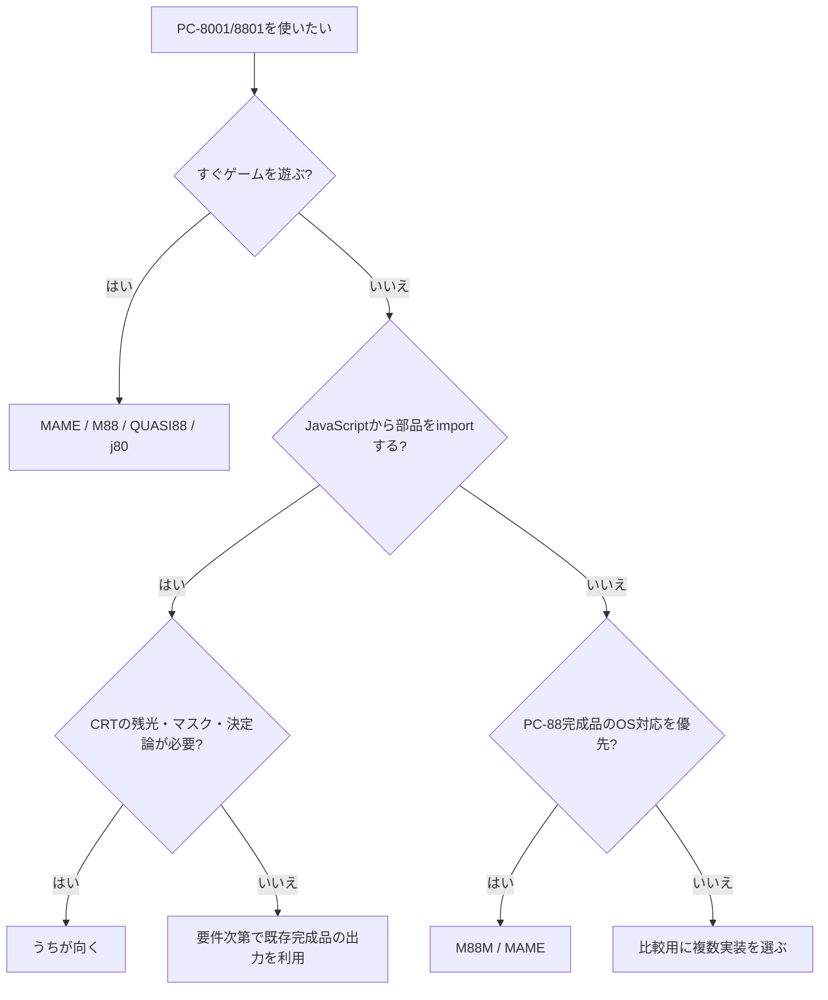

# 0. 要約

- 立ち位置: PC-8001/8801エミュレータの代替ではなく、チップ単位・headless実行・CRT物理を組み合わせられるJavaScriptライブラリとしてニッチ優位がある。
- 最大の弱点: MAME/M88/j80はゲームを遊べる完成品だが、本repoはFDDやROM同梱を含む利用開始までの経路が弱く、現状はnpmもprivateである。
- 次の一手: 公開APIを安定化し、`npm install`から決定論テストとCRTデモまでを一つの最小例で通し、視覚差分テストを直す。

# 1. このrepoは何か

一言でいえば、NEC μPD3301 CRTCとμPD8257 DMAを中心に、PC-8001/8801の一部マシン、Z80、ターミナル、CRT蛍光体・管物理をJavaScriptで再現する、依存ゼロのESモジュール群である。READMEだけでは「PC-8001エミュレータ」に見えるが、`package.json`のsubpath exportsと`docs/library.ja.md`を見ると、実際の提供単位はフルエミュレータ一体ではなく、下位チップからCRTレンダラーまでを個別にimportできるライブラリである。

利用時は、利用者のROM・D88などを前段から渡し、repoのチップ／マシンをheadlessで進め、必要なら`crt.js`と`tube.js`でフレームをRGBAに変換する。したがって比較単位は「単独のCRTC実装」ではなく、**ブラウザまたはNodeから再利用できるPC-8001/8801エミュレーション部品＋出力パイプライン**である。完成品エミュレータは、その部品を丸ごと置き換える選択肢として比較する。

想定利用者は、レトロPCの再現実験、ブラウザデモ、テスト可能なエミュレーション部品、CRT表現を組み込みたいJavaScript開発者である。ゲームをすぐ遊びたい利用者にはMAME、M88、QUASI88、j80の方が適する。

確認できた客観指標は、公開exports 20、runtime依存0、devDependencies 0、トップレベルのJavaScript/MJS 21,850行、テスト系MJS 5,232行である。`node --test`は27本中26 pass・1 fail（`test-crt-xterm.mjs`）だった。`package.json`の`private: true`により、npm上の採用状況は確認できない。

# 1.5 調査の型

`library`と判定する。入力を受けて状態を進め、描画結果やマシン状態を返すAPIがあり、`package.json`にsubpath exportsが定義されているためである。デモやブラウザUIは利用例であって、サービス提供ではない。比較の主軸は、完成品の機能数ではなく、APIの分割、決定論性、実装の重さ、ROM・メディア境界、出力の再利用性である。

なお、比較対象にはライブラリとして配布されていない完成品も含める。これは、利用者が「このrepoを使う代わりにPC-8001/8801を動かす」場合の置換先だからである。MAMEのPC-8001部分とM88のソースは確認したが、j80はソース非公開、QUASI88はこの調査で全ソースを再取得できなかった。そのため実装比較の確信度は中とし、未確認のAPI数や依存数は記載しない。

# 2. 比較対象と選定理由

| 製品 | 何ができるか | 採用状況 | ライセンス | うちとの決定的な違い | なぜ比較対象に選んだか |
|---|---|---|---|---|---|
| MAME | 多機種を一つのエミュレータ基盤で動かし、PC-8001/8801系も実装する | ★10.2k / 2026-03-30に0.287リリース。GitHub最終コミット日はこの調査で特定できず | GPL-2.0+（大部分はBSD-3-Clause） | ゲーム・機種対応の完成度と規模が圧倒的。一方、CRT物理の時間積分はPC-8001画面経路にない | PC-8001/8801を遊ぶ利用者の最も強い汎用代替で、CRTC/DMAの実装コードも読めるため |
| M88 | PC-8801シリーズをWindowsで動かす完成品。FDD、音源、実機ROM利用を含む | ★32 / 最終更新日はGitHubページで確定できず、100 commits表示 | M88固有条件。派生コードは2条項BSDだが、商用組込み等に追加条件 | 実機互換とゲーム用途を優先。再利用可能なJS APIやCRT物理は提供しない | PC-88側の代表的な軽量エミュレータで、公開ソースにCRTC/DMA実装があるため |
| QUASI88/libretro | PC-8000/8800シリーズをlibretroへ接続し、フロントエンドから遊ぶ | ★0 / 最終コミット日はこの調査で確定できず。53 tags | BSD-3-Clause + MAME non-commercial | 移植性と既存フロントエンド統合を優先。資料上、チップ状態より実用的な描画経路が中心 | 低依存で遊ぶための別設計であり、MAME/M88とは異なる「既存フロントエンドに乗る」選択肢だから |
| M88M | M88を現代OSへ移植したPC-8801完成品。Windows/macOS/Linux/FreeBSD等を対象 | ★3 / v1.2.0-refreshが2026-07-13 | 新規部分BSD-2-Clause。元M88・フォントは別条件 | M88の互換性を保ちながら配布・OS対応を現代化。ライブラリとしてのJS利用はしない | 現在も更新されるM88系の実用的な入口で、利用者の「今のOSで遊びたい」を代表するため |
| j80 | JavaでPC-8000シリーズを動かし、トレース・デバッグも提供 | GitHub starは不明 / 2017年の更新紹介を確認 | 不明 | PC-8001の実機互換・デバッグに強いが、ソース非公開で組み込みAPIは比較できない | 既存資料で27色技・可変属性・DMAアンダーラン対応が確認され、精度重視の直接競合になるため |

この地図は、完成品エミュレータの市場と、再利用ライブラリの市場がほぼ分離していることを示す。MAMEが知名度と機種数で寡占的だが、M88・QUASI88・j80はPC-8000系の特定互換性に価値を置く。repoは完成品の採用数で勝負する位置ではなく、ブラウザ・Node・テスト環境に組み込める部品性と、MAME/M88が通常の画面出力で省略するCRT物理を売りにするべきだと思う。

# 3. ポジショニング

公開指標が確認できた対象だけを置く。横軸は「完成品としてすぐ遊べる度」、縦軸は「JavaScriptから部品として再利用できる度」である。repo以外は後者が低く、座標は機能と配布形態からの評価であり、数値測定ではないため図にはしない。

# 4. 機能比較

| 機能 | 重み | うち | MAME | M88 | QUASI88 | M88M | j80 |
|---|---|---|---|---|---|---|---|
| PC-8001/8801のゲームを完成品として起動 | ◎必須（完成品用途なら） | △ ROM/ディスクを利用者が用意。FDD対応は限定的 | ○ | ○ | ○ | ○ | ○ |
| μPD3301のポート・属性・行DMA | ◎ | ○ | ○ | ○ | △（既存資料の実装比較） | ○（M88系） | ○（公開紹介・既存資料） |
| μPD8257のTC・オートロード | ◎ | ○ | ○ | ○ | ×（既存資料の比較） | ○（M88系） | ○（既存資料の比較） |
| DMAアンダーランを状態として扱う | ○ | ○ | △（MAMEソースにTODO） | ○ | ×（既存資料の比較） | ○（M88系） | ○（既存資料の比較） |
| FDD・D88を含むPC-88実用環境 | ◎ | △ `d88`/FDD部品はあるが利用経路は未完成 | ○ | ○ | ○ | ○ | ○ |
| JavaScript/Nodeから直接import | ◎ | ○ | × | × | × | × | × |
| DOM不要・headless決定論テスト | ◎ | ○（ただし全テストは26/27 pass） | △ | △ | △ | △ | ×（Java完成品） |
| CRT蛍光体・焼き付き・マスク・残光 | ◎（差別化） | ○ | △ 外部シェーダ等は別。PC-8001画面はフレームクリア | × | × | × | × |
| ANSIターミナル／CRTレンダラー単体利用 | ○ | ○ | × | × | × | × | × |
| ライセンスが組込みを妨げにくい | ◎ | ○ MIT | △ GPL-2.0+ | △ MAME non-commercialを含む | △ M88条件を引き継ぐ | △ 部分BSDだが元コード・フォント条件あり | 不明 |

最も痛い×は、ゲームを遊ぶためのFDD・ROM・入力・配布経路が完成品ほど一枚にまとまっていないことだ。ただし、これはrepoの本来の勝負所ではない。逆に、JavaScript import、headless決定論、CRT物理、ANSI端末は他製品の○と単純に数えられない差別化である。

MAMEのPC-8001実装もCRTC/DMAを持つため、「チップレベルだから唯一」という主張は成立しない。MAMEソース自身がColor Magicalの2画面交互を認識しつつ、残像統合はTODOとしている。ここにrepoのCRT物理の意味がある。一方、FDD対応を完成品と同じ水準まで追うと、MAME/M88との機能数競争になり、差別化が薄くなる。

# 4.5 コード・実装の比較

| 観点 | うち | MAME | M88 | QUASI88 / M88M / j80 | 出典 |
|---|---:|---:|---:|---:|---|
| 公開JavaScript subpath exports | 20 | — | — | — | `package.json`を実測（2026-07-31） |
| runtime依存パッケージ | 0 | — | — | — | `package.json`を実測（2026-07-31） |
| テスト実行 | 27本中26 pass、1 fail | — | — | — | `node --test`実測（2026-07-31） |
| トップレベルJS/MJS行数 | 21,850行 | — | — | — | `find … | xargs wc -l`実測（2026-07-31） |
| PC-8001実装の公開ソース | JS、CRTC/DMA/CRT/マシン分離 | C++、`pc8001.cpp`はGitHub表示3,900行 | C++、`src/pc88`以下にCRTC/DMA | QUASI88はC、M88MはM88移植、j80は非公開 | 各公開リポジトリと`docs/comparison.ja.md` |
| API／配布形態 | import可能なMIT ES module。現在private | 大規模な実行可能エミュレータ | Windows完成品。M88条件あり | 完成品またはフロントエンド向け。JS APIなし | 各README・LICENSE |

この表で比較できる重さは、repoの「小さな依存ゼロ部品」という性格であり、完成品の総コード量と競うものではない。MAME/M88は一つの実行環境として多くを抱えるので、repoの21,850行が少ないこと自体が精度の証明にはならない。むしろ20 exportsと依存0が、CRTだけ・端末だけ・チップだけを選べることを示す。

`node --test`の失敗は、再利用ライブラリとしての信頼に直接響く。失敗内容の原因はこの調査では特定していないため、原因を推測して補わない。少なくとも市場向けの最小例を出す前に、全テストgreenまたは失敗の既知化が必要である。

# 5.5 調査者の見立て

本当の勝負所は「MAMEより正確か」ではなく、**ブラウザ／Nodeのコードから、チップ精度とCRTの時間的見え方を同じ決定論パイプラインで呼べるか**だと読める。MAMEとM88がチップ接続を実装している以上、チップレベル単独は差別化にならない。

数字に出ていない懸念は、`private: true`と失敗テストが、外部利用者にとって「これは作品か、利用可能な部品か」を曖昧にしていることだ。READMEは機能が豊富だが、最小API・対応範囲・未対応のFDDを一目で選べる導線は弱いと思う。

自分なら、まずFDDを広げる前に、`upd3301`を「依存ゼロ・headless・CRT物理付きのPC-8001表示SDK」として固定し、公開可能な最小パッケージ、APIリファレンス、golden frameの3点を整える。

この見立てが外れるのは、利用者の大半がライブラリ組込みではなく「ゲームを遊べるPC-8801エミュレータ」を求めていると分かった場合である。また、MAME側がCRT残光・焼き付きまで標準経路に取り込んだ場合、現在の最大差別化は消える。

# 6. 提案（優先順）

| 順 | 提案 | 分類 | 根拠 | 最小の一手 | 効きそうな指標 |
|---:|---|---|---|---|---|
| 1 | 公開APIを「チップ／マシン／CRT／Terminal」の4入口に整理し、最小実行例を各1つ用意する | 伸ばす | 20 exports・依存0・subpath設計が既にある | `docs/library.ja.md`の例を実際に実行するsmoke testへ固定 | 初回成功率、API破壊変更数、外部サンプル数 |
| 2 | `test-crt-xterm.mjs`の失敗を解消し、フレームハッシュまたは許容誤差付きgolden testをCI相当の標準にする | 埋める | 27本中1本失敗。CRT物理が差別化なので視覚回帰が重要 | 失敗原因を切り分け、Nodeで比較できる最小フレームfixtureを1つ追加 | 全テストpass率、フレーム回帰検出数 |
| 3 | npm公開可否とライセンス／ROM境界を明記し、ROMなしで動くデモを公開する | 埋める | 現在`private: true`。MAME/M88はROM・配布条件が採用障壁 | package公開設定の判断文書、BYO-ROMサンプル、D88の最小fixtureを用意 | installからdemoまでの時間、npm取得数 |
| 4 | CRT物理の実機・録画比較を「見た目の優劣」ではなく再現条件付きサンプルとして蓄積する | 伸ばす | MAMEソースもColor Magicalの残光統合を未実装としており、差別化の説明余地がある | P22/P7・27色・焼き付きの入力、出力、観察条件を固定した3サンプルを作る | サンプル再現率、外部検証コメント数 |
| 5 | MAME/M88と同じ完成品エミュレータ競争のために、FDD・全機種・GUIを優先実装する | やらない | 既存完成品が採用と機種対応で優位。libraryの差別化を薄める | 実装せず、READMEに「完成品用途はMAME/M88」を明記 | ライブラリ利用者の離脱理由を記録 |

提案1と2が順序の核である。市場で珍しい機能を増やすより、現在すでにある部品性とCRT物理を第三者が再現できる状態にする方が、比較表の◎に効く。提案3は採用の入口で、MITであることだけでは利用者はインストール方法を推測できない。提案5は明確にやらない方がよい範囲であり、完成品の不足を埋めること自体を目的にしない。

# 7. 選択の分岐

このrepoを選ばない条件は明確で、ゲームの互換性、FDD、GUI、ROM管理が最優先なら完成品を選ぶべきである。逆に、Node／ブラウザのテスト、部品差し替え、CRTの時間積分を一つのJavaScriptパイプラインで扱う要件なら、既存完成品を丸ごと組み込むよりrepoの立場が合う。

# 8. 出典

| URL | 参照日 | 何の根拠に使ったか |
|---|---|---|
| `README.md`（repo内） | 2026-07-31 | repoの目的、対応範囲、未対応・ROM方針、使い方 |
| `package.json`（repo内） | 2026-07-31 | MIT、private、20 exports、依存0、テストコマンド |
| `docs/library.ja.md`（repo内） | 2026-07-31 | ライブラリとしての利用単位、レイヤ分離、CRT API |
| `docs/comparison.ja.md`（repo内） | 2026-07-31 | QUASI88/MAME/M88/j80の比較、ソース読解済みの既存記録 |
| `https://github.com/mamedev/mame` | 2026-07-31 | MAMEの★10.2k、GPL-2.0+、0.287リリース、規模 |
| `https://github.com/mamedev/mame/blob/master/src/mame/nec/pc8001.cpp` | 2026-07-31 | PC-8001のCRTC接続、Color Magical、残光統合TODOのソース確認 |
| `https://github.com/mamedev/mame/blob/master/src/devices/video/upd3301.cpp` | 2026-07-31 | MAMEのuPD3301実装が公開されていること、API／実装比較 |
| `https://github.com/rururutan/m88` | 2026-07-31 | M88の★32、100 commits、PC-8801用途、ライセンス条件、ソース構成 |
| `https://github.com/kodi-game/game.libretro.quasi88` | 2026-07-31 | QUASI88/libretroの★0、53 tags、BSD-3-Clause + MAME non-commercial、libretro用途 |
| `https://github.com/bubio/M88M` | 2026-07-31 | M88Mの★3、v1.2.0-refresh（2026-07-13）、対応OS、ライセンス説明 |
| `https://www.eonet.ne.jp/~showtime/quasi88/index.html` | 2026-07-31 | QUASI88公式サイトのPC-8801エミュレータ情報 |
| `https://www.emu-france.com/news/48142-ordi-hal8999-emulators-update-2017-01-07/` | 2026-07-31 | j80のJava製PC-8000系エミュレータ、精度・デバッグ機能、公開更新情報 |
| `https://www.valgus.info/archives/12529153.html` | 2026-07-31 | j80の実利用者による再現性・デバッグ機能の評価。二次情報なので断定には使わない |

MAME/M88/QUASI88/j80のコード・採用状況を同じ粒度で完全に取得できたわけではない。特にj80のstar数・ライセンス、M88とQUASI88の正確な最終更新日は分からないため「不明」とした。推測で補わず、`confidence: 中`に留めた。
