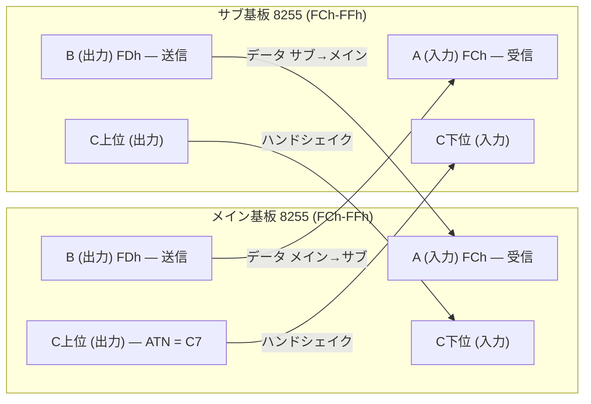
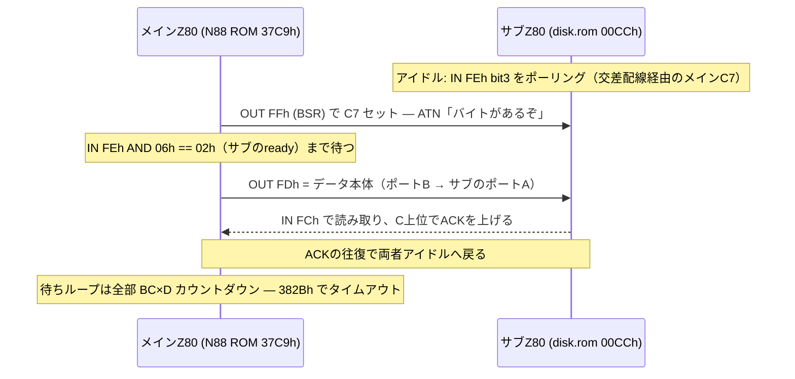
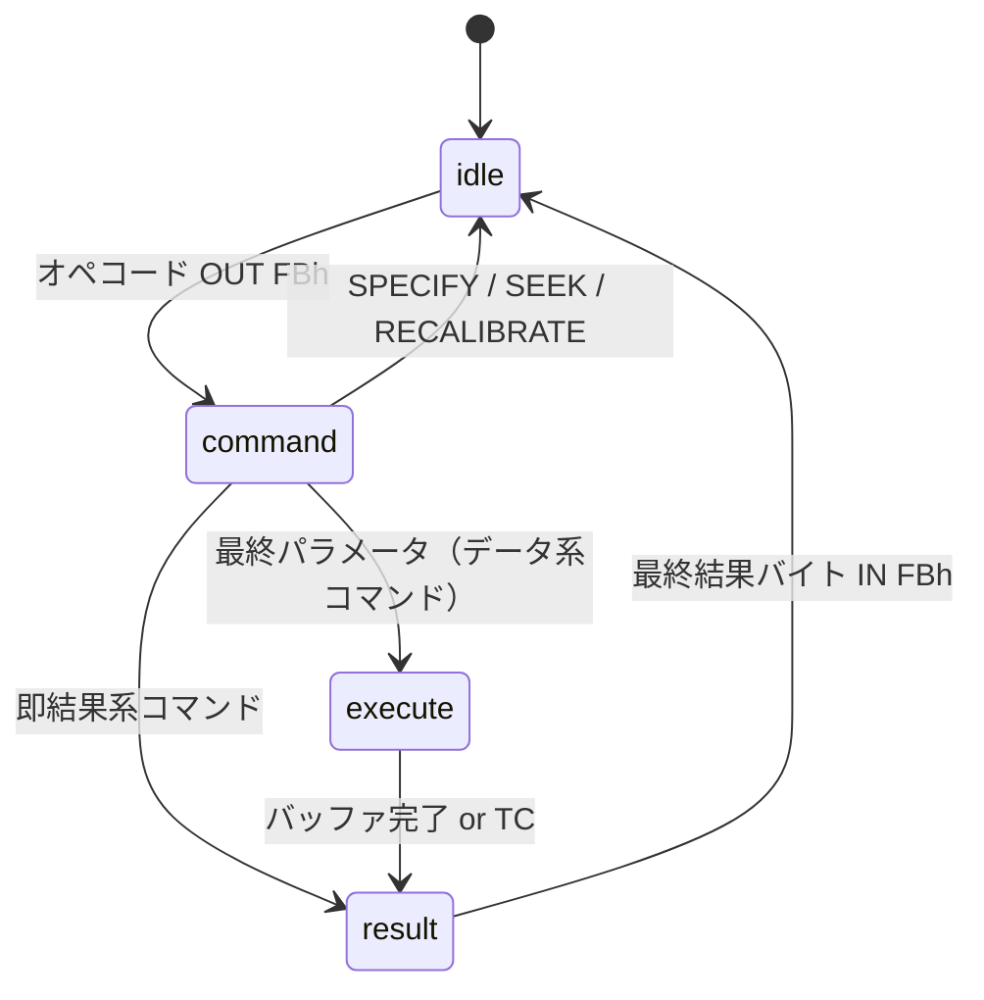
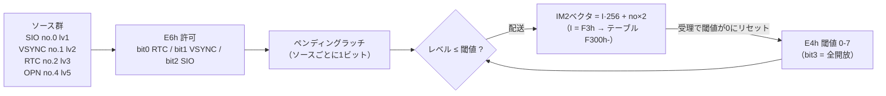

[English](./peripherals.md) · **日本語**

```
┌────────────────────────────────────────────────────────────────────┐
│  N E C   E L E C T R O N I C S                （エミュレータ再現版）│
│                                                                    │
│   μPD8255  プログラマブル ペリフェラル インターフェイス             │
│   μPD765   フロッピーディスク コントローラ                          │
│   μPD8214  プライオリティ割り込みコントロール ユニット              │
│   μPD8251  USART                                                   │
│                                                                    │
│   技術資料 第2巻 — 本リポジトリの実装仕様                    Rev.EX │
└────────────────────────────────────────────────────────────────────┘
```

*本リポジトリのチップ資料・第2巻。第1巻 — μPD3301 CRTC + μPD8257 DMAC —
は [datasheet.ja.md](./datasheet.ja.md)。流儀は同じ：70年代末のデータブック
風に整形し、数値はすべて本リポジトリのソース（`i8255.js`・`upd765.js`・
`pc80s31.js`・`machine88.js`・`machine.js`・`d88.js`）まで遡れる。スタブは
スタブと正直に書く。**EX** 印は架空シリコンで、NEC製ではない。*

---

# μPD8255 — プログラマブル ペリフェラル インターフェイス

## 特長

- 8ビットポート3本（A, B, C）。方向は制御語で設定
- ポートCのビット単発セット/リセット（BSR）：他のビットに触れず1本だけ操作
- **モード0（基本入出力）のみ** — PC-8801が使うのはこれだけ
  （`i8255.js` はまさにこれ＝ラッチ＋制御語をモデル化）
- モードセットで**全出力ラッチがクリアされる** — 実チップの挙動を再現
- 電源投入時：制御語 9Bh ＝ 全ポート入力

## 制御語（モード0）

| Bit | 意味 |
|-----|---------|
| 7 | 1 = モードセット（0 = BSR、下記） |
| 6–5 | グループAモード（00 = モード0。他は未モデル化） |
| 4 | ポートA: 1 = 入力 |
| 3 | ポートC上位: 1 = 入力 |
| 2 | グループBモード（0 = モード0） |
| 1 | ポートB: 1 = 入力 |
| 0 | ポートC下位: 1 = 入力 |

9Bh = `1001_1011` — A・B・C全入力（電源投入時）。ディスクサブ基板のROMは
**91h** ＝ A入力 / B出力 / C上位出力 / C下位入力 を設定する（サブROM
00B1h で命令単位に検証済み、`romlabels.js`）。メイン側は配線の必然として
その鏡像設定になる。制御レジスタの読み返しは実チップでは未定義。本エミュ
レータはFFhを返す。

## BSR — ポートC ビットセット/リセット

bit 7 = 0 の制御語書き込み：`0xxx_BBBS` — bit 3–1 でポートCのビットを
選択、bit 0 が値。メインCPUがハンドシェイク線（ATNなど）を
リード・モディファイ・ライトなしに1本ずつ操作する手段がこれ。

入力に設定されたポートは**相手が駆動している値**を読む。相手がいなければ
FFh（浮きバス、プルアップ）。このFFhが重要な仕事をする：ドライブなしの
PC-8801が起動できる理由がこれ（後述）。

## PC-8801のペア構成（本章の本題）

PC-8801はこのチップを**同じポートアドレスに2個**積む — メイン基板の
FCh–FFh とディスクサブ基板の FCh–FFh。両者は A↔B 交差・Cニブル交差で
互いに配線されている（`i8255.js` の `crossWire()`）：



どちらのCPUから見ても同じ配置になる：FCh＝受信データ、FDh＝送信データ、
FEh＝相手のハンドシェイクビット、FFh＝制御。有名なブートハンドシェイクの
正体は、2個のZ80がこのラッチを互いにパタパタさせているだけである。

## ハンドシェイクプロトコル（ROMを実際に歩いた記録）

プロトコル自体は一切エミュレートしていない — **ROMがプロトコルそのもの**
だからだ。以下はN88メインROM（`sub_send_byte`, 37C9h）と2KBサブROM
（`idle_poll_loop`, 00CCh）が実際にやっていること（`romlabels.js` で命令
単位に検証済み）：



- **ATN** ＝メインのC7。サブからは FEh bit 3 に見える（ニブル交差）。
- メイン側の待ちループはすべて BC×D カウントダウンで保護されている
  （`sub_hs_timeout`, 382Bh）。**サブ基板が無い**と全読み出しがFFhに浮き、
  タイムアウトが満了してブートROMはBASICへ抜ける — ドライブなしPC-8801
  そのままの挙動。`machine88.js` は「サブ側を作らない」だけでこれを再現
  している。
- 逆方向（`sub_recv_byte`, 3847h）は：FEh bit 0 を待って IN FCh。

**エミュレータのスケジューリング注記**（`machine88.js`）：メインCPUが
FCh–FFh をポーリングして同じ答えが32回以上続いたら、サブCPUに×16の
T-stateを貸す — QUASI88と同じ手口。これが無いと、サブROMのモーター安定
待ち（02B4h の二重65536ループ ≈ 0.85秒×2回）がメインROMの BC×D タイム
アウトとの競走に負ける。

---

# μPD765 — フロッピーディスク コントローラ

「THE」フロッピーチップ。NECが設計し、Intelが **8272** としてライセンス
生産し、IBMがそれをPCに載せた — つまり世界中のPC BIOSが知っているあの
インターフェイスは、このチップの流儀である。PC-8801ではディスクサブ基板に
載り、**サブ**CPUが2ポート — メインステータスレジスタ（MSR）とデータ
レジスタ — で会話する。

## 3つのフェーズ

すべては小さな状態機械である（`upd765.js`）：



## メインステータスレジスタ（サブ基板ポートFAh）

| Bit | 名前 | 意味 |
|-----|------|---------|
| 7 | RQM | request for master — データレジスタ準備完了 |
| 6 | DIO | データ方向: 1 = FDC→CPU |
| 5 | EXM | 実行フェーズ中（非DMA） |
| 4 | CB | コントローラビジー |
| 3–0 | D3B–D0B | ドライブnビジー（シーク中） |

本エミュレータでのフェーズ別読み値：idle **80h**、command **90h**、
execute **F0h**（読み）/ **B0h**（書き）、result **D0h**。D3B–D0B は常に0
— 本モデルではシークが即時完了するため、実チップでこれが立つ時間窓が
そもそも存在しない。正直な制限事項。

## 非DMAモード（サブROMがEI/HALTする理由）

PC-8801サブ基板は765を非DMAモードで使う：実行フェーズ中、チップは
**1バイトごとにINT**を上げる。INTピンはサブZ80に直結（IM 0、バスが浮いて
NOPになる — `pc80s31.js`）なので、2KBのサブROMは文字どおり `EI / HALT`
で寝て、1バイトごとに起こされてはポートFBhを読み書きし、また寝る。
`upd765.js` では：データの読み書きごとにINTが落ち、残りバイトがあれば
再度上がる。結果フェーズ突入でINTが上がり、最初の結果バイト読み出しで
落ちる。シーク完了割り込みは別キューで、SENSE INTERRUPT STATUS が
排出するまでINT線を保持する。

## コマンド一覧（実装分）

オペコード＝先頭バイトの下位5ビット。バイト数はオペコード込み
（`upd765.js` の `CMD_LEN`）。

| Op | コマンド | Cmd | 結果 | 備考 |
|----|---------|-----|------|-------|
| 02h | READ DIAGNOSTIC | 9 | 7 | インデックスホールからトラックの**全セクタ**をID照合なしで流す — プロテクトの大好物 |
| 03h | SPECIFY | 3 | — | タイミング＋NDビット。ここでは観測可能な効果なし |
| 04h | SENSE DEVICE STATUS | 2 | 1 | ST3を返す |
| 05h | WRITE DATA | 9 | 7 | |
| 06h | READ DATA | 9 | 7 | マルチセクタ: R < EOT の間 R+1 へ継続 |
| 07h | RECALIBRATE | 2 | — | ヘッドをトラック0へ。完了はシーク完了INT |
| 08h | SENSE INTERRUPT STATUS | 1 | 2 | ST0＋現シリンダ。ペンディングなし → ST0 = 80h |
| 09h | WRITE DELETED DATA | 9 | 7 | セクタのdeletedフラグを立てる |
| 0Ah | READ ID | 2 | 7 | 呼ぶたびにトラック内セクタを巡回 — ディスク回転をインデックスでモデル化 |
| 0Ch | READ DELETED DATA | 9 | 7 | |
| 0Dh | FORMAT A TRACK | 6 | 7 | SC×4 のIDバイトを受理して捨てる — イメージは書き換えない（正直スタブ） |
| 0Fh | SEEK | 3 | — | 完了はシーク完了INT |
| 11h/19h/1Dh | SCAN系 | 9 | 1 | 長さのみデコード、実行未実装 → ST0 = 80h invalid |

その他のオペコード → 結果1バイト ST0 = 80h（invalid command）。実チップの
有名な「80hの肩すくめ」と同じ。

## ステータスレジスタ

**ST0** — bit 7 IC（invalid command, 80h）、bit 6 AT（異常終了）、
bit 5 SE（シーク完了）、bit 3 NR（not ready）、bit 2 HD、bit 1–0 US。

**ST1** — 20h DE（データエラー/CRC）、04h ND（no data — セクタ不在）、
02h NW（書き込み禁止）。本エミュレータは空ドライブへの読み書きに ST1 =
**08h** を返すが、これはリポジトリ独自の目印で、実チップでは未使用ビット。

**ST2** — 40h CM（control mark: READ DATAがdeletedセクタに当たった）、
20h DD（データ部のデータエラー）。

**ST3**（SENSE DEVICE STATUS）— bit 6 書き込み禁止、bit 5 ready
（ディスクなしで落ちる）、bit 4 トラック0、bit 3 両面（常時1）、
bit 2 ヘッド、bit 1–0 ユニット。

## シークの意味論（実チップ準拠）

SEEK と RECALIBRATE は**実在するドライブユニットならディスクの有無に
かかわらず正常終了する** — ヘッドはメディアがなくても動くからだ。
ST0 = 20h|US（SE）。失敗するのは*存在しない*ユニットだけ：サブ基板は
2ユニット配線なので、ユニット2–3は ST0 = 68h|US（AT|SE|NR）が返る。
N88ブートはまさにこれでドライブマップを探る（ユニットごとに RECAL +
SEEK 10 + RECAL、サブROM 015Dh）。完了通知は割り込み＋SENSE INTERRUPT
STATUS であり、結果フェーズではない。

## D88透過性（プロテクト保存）

ディスクはパース済みD88（`d88.js`）：各セクタが自前の C/H/R/N ID、密度
（00h MFM / 40h FM）、deletedフラグ（オフセット7 = 10h）、ステータス
バイト（オフセット8）を持つ。FDCはイメージを解釈しない — **報告する**。
実チップがメディアの言い分をそのまま返したのと同じ流儀：

| D88セクタのフィールド | 現れ方 |
|------------------|-------------|
| status A0h / B0h | ST0 AT + ST1 DE（B0hはST2 DDも）— 不良CRCが生き残る |
| status F0h | ST0 AT + ST1 ND — 幻セクタが生き残る |
| その他の非ゼロstatus | ST0 AT + ST1 DE |
| deletedフラグにREAD DATAが命中 | ST2 CM |
| ヘッダの書き込み禁止バイト（1Ah = 10h） | 書き込み開始時に ST1 NW |
| 重複ID・異常サイズ | 表現可能、そのまま返す |

コピープロテクト付きディスクが無改造で動くのはこのため：プロテクトの
チェックルーチンがこれらのビットを読み返すと、1985年と同じ答えが返る。

## サブ基板 I/Oマップ

| ポート | 機能 |
|------|----------|
| F8h in | **FDCのTCピンをパルスする** — そう、*読み出し*が出力ピンを叩く。基板上で一番安上がりなデコード＝INのリードストローブをそのままパルスに流用。返り値はFFh。 |
| F8h out | ドライブモーター |
| FAh | μPD765 MSR |
| FBh | μPD765 データ |
| F4h / F7h | ドライブモード / プリンタ（無視） |
| FCh–FFh | 8255（メイン基板側と交差配線） |

---

# μPD8214 — プライオリティ割り込みコントロール ユニット

本巻の目玉。PC-8801の割り込みポート E4h/E6h は「レベル」「マスク」と
あちこちに書かれているが、*実際にどう振る舞うか*は本リポジトリが実測で
復元した — 本物のN88-BASIC ROMを候補モデルに対して走らせ、ブートトレース
が一致するまで追い込んだ結果である（`machine88.js`、issue #4）。復元した
意味論：

## 実測セマンティクス

**E4h — 受理閾値。** ペンディング中のソースは、そのレベル ≤ 閾値 の間
配送される。bit 3 を立てると全開放（閾値 = 7）、それ以外は bit 2–0 が
閾値。**割り込みを受理すると閾値は0にリセットされる** — 門が閉まるので、
各ハンドラは次の割り込みが届く前に `OUT E4h` で再武装しなければならない。
N88-BASICがE4hを書きまくる理由がこれで、コールドスタートの締めも
`E4h ← FFh` である（72CDh、`romlabels.js`）。

**E6h — ソース別許可。** bit 0 = RTC（1/600秒インターバルタイマ）、
bit 1 = VSYNC、bit 2 = SIO。ソースを禁止するとペンディングフラグも落ちる。

**ベクタ。** Z80 IM 2。ベクタ下位バイト＝**ソース番号 × 2**。N88-BASICは
I = F3h を設定するので、ハンドラテーブルは F300h に並ぶ。

| ソース | 番号 | ベクタ | 8214レベル | E6h許可 | 発生源（本リポジトリ） |
|--------|------|--------|-----------|------------|----------------------|
| SIO (8251) | 0 | 00h | 1 | bit 2 | なし — 8251はスタブ |
| VSYNC | 1 | 02h | 2 | bit 1 | 毎フレーム末、60 Hz |
| RTC | 2 | 04h | 3 | bit 0 | インターバルタイマ、600 Hz |
| SOUND (OPN) | 4 | 08h | 5 | —（実機はport 32h側） | なし — YM2203はスタブ（44h/45hは00h） |

番号付けが二系統あることに注意：**ソース番号**がベクタを作り、**8214
レベル**が閾値と勝負する。レベルが小さいほど優先度が高い — SIO＞VSYNC＞
RTC＞SOUND。



N88-BASICが生きている再武装の舞い：割り込み受理 → 閾値0 → 門が閉まった
ままハンドラ実行 → ハンドラが `OUT E4h`（再武装）→ `EI` → `RET`。
再武装を一度でもサボると、マシンは永遠に耳が聞こえなくなる。

## なぜ「閾値」なのか？（歴史考察 — 推論であると明記する）

μPD8214はIntel 8214のNECセカンドソース — **8080世代のプライオリティ
割り込みコントロールユニット**である。要求をソフトウェア管理の
「カレントステータス」フェンスと比較するプライオリティエンコーダで、
イン・サービスのスタックも無ければ、EOIコマンドも無い。上で実測した
挙動はすべてこの素性と整合する：チップは「いま何をサービス中か」を
覚えられないから、受理と同時にフェンスを底まで叩き落とし、引き上げは
ソフトウェアに委ねるのだ。8801の設計陣はこの8080時代の部品を、
エンコード済みソース番号をベクタ下位ビットに食わせることでZ80のIM 2
オートベクタに接ぎ木した — PC世界が標準化した8259より安く、古い解法で
あり、8801の割り込みハンドラが揃って `OUT E4h` 反射を持つ理由でもある。
この段落は実測挙動からの考古学的推論として読んでほしい。NECデータブック
からの引用ではない。

---

# μPD8251 — USART（正直スタブ）

## 実チップの概説（背景知識）

汎用の同期/非同期レシーバ・トランスミッタ。リセット後にまず**モード語**
（ボーレート係数・文字長・パリティ・ストップビット）、続いて**コマンド語**
（TxEN・RxE・エラーリセット・内部リセット…）を受け取る。ステータス
レジスタは TxRDY / RxRDY / TxEMPTY とエラーフラグを報告する。PC-8001/
8801ではポート **20h（データ）/ 21h（モード・コマンド / ステータス）**に
座り — そしてここが面白いところだが — **カセットインターフェイスは
このチップの上に乗っている**：CMTの正体は8251のシリアルストリームを
FSK変調でテープに落としたもの（あの1200/2400 Hzの唸り。PC-8001で600
ボー、88系で1200ボー）で、モーターリレーはポート30h側。CPUは音声を
一切聞かない。聞くのはシリアルバイトだけである。μPD8214のソース0
（レベル1、ベクタ00h、E6h bit 2）はこのチップの割り込み用に確保されている。

## 本リポジトリでの現状（スタブ）

- `machine.js`（PC-8001）：ポート20h/21hの読み出しは **00h** — 平坦なスタブ。
- `machine88.js`（PC-8801）：ポート自体をデコードしていないので **FFh**
  （プルアップされた浮きバス）が返る。
- SIO割り込みは一度も発生しない。8214のソース0の席は配線されたまま
  待ちぼうけ。
- 帰結：**CMT（カセット）ロードはまだ動かない。** 8251＋FSKデコード済み
  テープイメージの実装は将来課題。それまでこの節は、穴を糊塗せずに
  穴として文書化しておく。

---

# クロック体系（周波数の系譜）

このマシンたちの周波数がどこから来るか — 本リポジトリの設定値を軸に、
確かな系譜はそのまま、伝承レベルの話は*伝承と明記して*描く。

## PC-8001 — 3割はどこへ消えたか

`machine.js` の既定値：`clockHz = 4_000_000`、`dmaSteal = 0.3`。Z80は
公称4 MHzで走るが、μPD8257が水平帰線のたびにテキストVRAMバースト転送で
バスマスタになり、その間CPUは単純にバスから外れる — 全サイクルの約30%。
フレーム予算は

```
frameT = round(4_000_000 / 60 × (1 − 0.3)) = 46,667 T-state/フレーム
```

— *実効* ≈ 2.80 MHz。「PC-8001は遅い」と言われた真因がこれである。
CPUは無実で、人生の3分の1を自分の画面のために待たされていただけだ。
（バースト自体は第1巻参照：25行 × 120バイト = 3000バイト/フレーム、
DMAチャネル2。）

## PC-8801 — なぜ4.0000でなく3.9936か

`machine88.js` は `clockHz = 3_993_600` を設定する。誤記ではない：実機
8801のCPUクロックは3.9936 MHzで、4に0.16%届かない。この数はマシンの
ビデオクロック族に綺麗に割り付く — ×4 = 15.9744 MHz、×8 = 31.9488 MHz —
つまりCPUクロックは自前の4.000 MHz水晶ではなく、ビデオマスター水晶の
分周である。この水晶族の出自は通例NTSC系統（PC-8001に14.318 MHz級の
ドットクロックを与えたのと同じ伝統）と説明される。本書では分周関係を
事実として述べ、NTSC祖先説は「通例の説明」として述べるに留める（検証済み
データシートの系譜としては主張しない）。

ディスクサブ基板も**同じ3.9936 MHz**で走る（`machine88.js` が自分の
`clockHz` を `Pc80s31` に渡す）が、**自前のバス**を持つ — DMA横取りが
無い。メインCPUの進行1 T-stateあたりサブは `subRatio = (clockHz/frameHz)
/ frameT ≈ 1.43` T-state走る。すなわちメインが削られて46,592のところ、
サブは満額66,560 T/フレーム。

## あの音とタイマ群

- 水平偏向：`crtc.hsyncHz() = frameHz × (行数 + 垂直帰線行) ×
  文字あたりライン数`（`index.js`）。N-BASIC 80×25なら 60 × (25+7) × 8 =
  **15,360 Hz** — 一世代まるごと、いまだに耳に残っているあの音。
- RTCインターバル割り込み：**600 Hz**（1/600秒）— `machine88.js` は
  60 Hzフレームあたり10回刻む。ディスクBASICはこれで眠る（EI/HALT）。
  無いとマシンは永遠にHALTしたまま。
- VSYNC：**60 Hz**、フレーム末に発生。VRTCフラグ（IN 40h の d5）は
  フレーム予算の尻尾としてモデル化：PC-8001は末尾22%、PC-8801は末尾14%。

## まとめ表

| 周波数 | 値 | コード上の出所 | 由来 |
|-----------|-------|----------------|--------|
| PC-8001 CPU | 公称 4.0000 MHz | `machine.js` `clockHz` | 自前クロック。ただしバスは… |
| PC-8001 実効 | ≈ 2.80 MHz | `dmaSteal = 0.3` → frameT 46,667 | 8257が毎水平帰線に横取り |
| PC-8801 メインCPU | 3.9936 MHz | `machine88.js` `clockHz` | ビデオマスター分周（×4 = 15.9744 MHzドット族） |
| PC-8801 サブCPU | 3.9936 MHz | `Pc80s31` `clockHz` | 同一クロック、自前バス、横取りなし |
| 水平同期 | 15,360 Hz（80×25） | `crtc.hsyncHz()` | 60 × (25+7) × 8 |
| VSYNC / フレーム | 60 Hz | `frameHz` | フィールドレート |
| RTC割り込み | 600 Hz | `stepFrame()` タイマ、frameT/10 | 1/600秒インターバルタイマ |

---

# 付録 — PC-8012バンクRAM（E2h/E3h）とEXバンク

## 実機プロトコル（PC-8012拡張ユニット）

0000–7FFFh に被さる32KB RAMボード、最大8枚（`machine.js`。既定のマシンは
4枚実装）。**独立した**ビットマップが2本：

| ポート | 機能 |
|------|----------|
| E2h | バンク別**リード**許可ビットマップ（bit n = ボードn） |
| E3h | バンク別**ライト**許可ビットマップ |

リードとライトが別レジスタなので、配線から正当な技が2つ転がり出る：

- **ROMを読みながら裏のRAMに書く** — リード許可オフ・ライト許可オン：
  フェッチは引き続きN-BASIC ROMから、ストアは裏のバンクへ着地。
- **同報書き込み** — ライトビットを複数立てれば `LD (HL), A` 1発が
  選択中の全ボードに同時に着弾。ビットマップ配線そのままの、ボード横断
  高速ブロッククリア。

複数バンクのリード許可が立っている場合、本エミュレータは最小番号の
バンクを返す（実機ではバス競合になる。やらないこと）。IN E2h/E3h は
本実装ではビットマップを読み返せる。PC-8801はこのリード/ライト分離
プロトコルをそのまま拡張RAMに継承した — `machine88.js` は現状 E2h/E3h
（EMM）の読み出しをFFhでスタブしており、未モデル化。

## EXバンク（本リポジトリの空想。明記しておく）

コンストラクタに8枚超（`extRamBanks > 8`）を頼むと、マシンはビットマップ
の代わりにバンク番号レジスタを生やす — **NECではない。純然たるEX
シリコン**：

| ポート | 機能（EX） |
|------|---------------|
| E0h | バンクインデックス下位バイト |
| E1h | バンクインデックス上位バイト |
| E2h/E3h | bit 0 = 選択中バンクのリード / ライトゲート |

65,536バンク × 32KB = **Z80に2 GiB**。ストレージは遅延確保 — 触るまで
バンクはタダ — だが、CPUはそうはいかない：2 GiBを `LDIR`（21 T-state/
バイト）で埋めると約**3時間**かかる。8枚ビットマップが既定であり正史。
