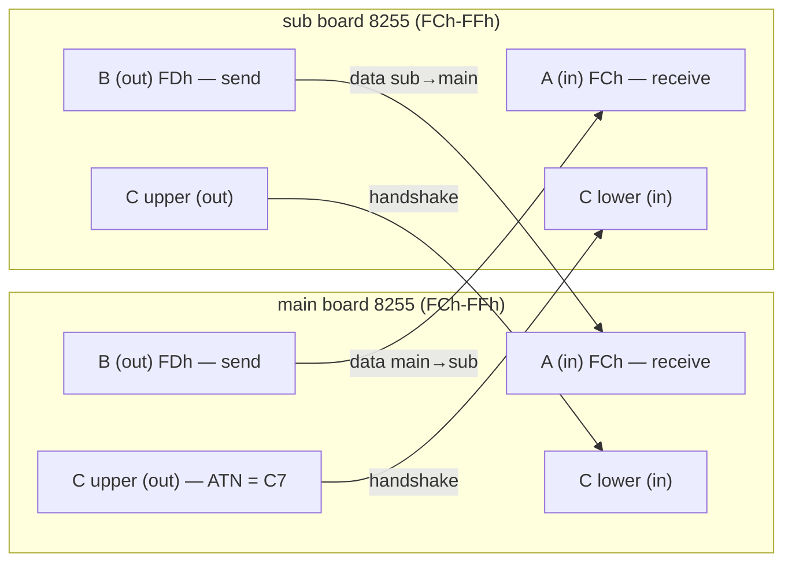
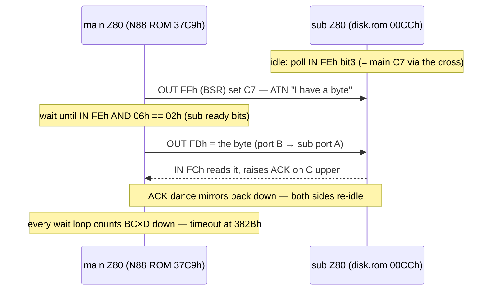
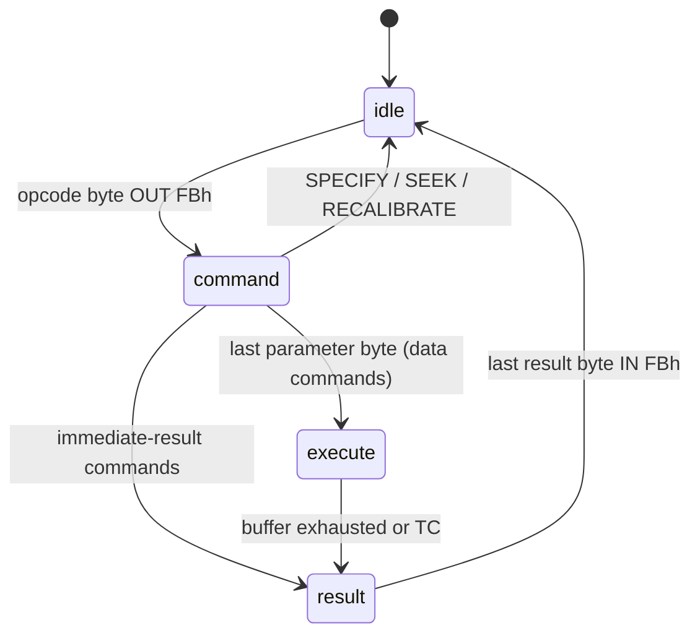
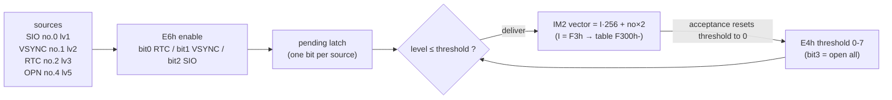

**English** · [日本語](./peripherals.ja.md)

```
┌────────────────────────────────────────────────────────────────────┐
│  N E C   E L E C T R O N I C S            (emulator reproduction)  │
│                                                                    │
│   μPD8255  PROGRAMMABLE PERIPHERAL INTERFACE                       │
│   μPD765   FLOPPY DISK CONTROLLER                                  │
│   μPD8214  PRIORITY INTERRUPT CONTROL UNIT                         │
│   μPD8251  USART                                                   │
│                                                                    │
│   TECHNICAL DATA vol.2 — as implemented by this repository  Rev.EX │
└────────────────────────────────────────────────────────────────────┘
```

*Volume 2 of this repo's chip documentation. Volume 1 — μPD3301 CRTC +
μPD8257 DMAC — is [datasheet.md](./datasheet.md). Same house rules: styled
after late-70s databook sheets, every number traceable to this repo's
source (`i8255.js`, `upd765.js`, `pc80s31.js`, `machine88.js`, `machine.js`,
`d88.js`); whatever is a stub says so out loud; anything marked **EX** is
fantasy silicon, not NEC's.*

---

# μPD8255 — PROGRAMMABLE PERIPHERAL INTERFACE

## FEATURES

- Three 8-bit ports (A, B, C); direction programmed by a control word
- Port C bit set/reset (BSR): poke one bit without disturbing the rest
- **Mode 0 (basic I/O) only** — that is all the PC-8801 ever uses
  (`i8255.js` models exactly this, latches + control word)
- Mode set **clears all output latches** — real-chip behavior, reproduced
- Power-on state: control word 9Bh = every port an input

## CONTROL WORD (MODE 0)

| Bit | Meaning |
|-----|---------|
| 7 | 1 = mode set (0 = BSR, below) |
| 6–5 | group A mode (00 = mode 0; others not modeled) |
| 4 | port A: 1 = input |
| 3 | port C upper: 1 = input |
| 2 | group B mode (0 = mode 0) |
| 1 | port B: 1 = input |
| 0 | port C lower: 1 = input |

9Bh = `1001_1011` — A, B, C all input (power-on). The disk sub-board ROM
programs **91h** = A in / B out / C upper out / C lower in (verified at sub
ROM 00B1h, `romlabels.js`); the main side needs the mirror-symmetric setup
by wiring necessity. Reading the control register back is undefined on the
real chip; this emulator returns FFh.

## BSR — PORT C BIT SET/RESET

Control write with bit 7 = 0: `0xxx_BBBS` — bits 3–1 select the port C bit,
bit 0 is the value. This is how the main CPU flips single handshake lines
(ATN and friends) without a read-modify-write.

A port programmed as input reads **whatever the other end drives — or FFh
if nothing is connected** (floating bus, pulled high). That FFh is
load-bearing: it is how a drive-less PC-8801 boots (below).

## THE PC-8801 PAIR (the actual subject)

The PC-8801 carries *two* of these at the *same* port addresses — one on
the main board at FCh–FFh, one on the disk sub-board at FCh–FFh — wired to
each other, A↔B crossed and C nibbles crossed (`crossWire()` in
`i8255.js`):



Each CPU sees the same layout: FCh = incoming data, FDh = outgoing data,
FEh = the other side's handshake bits, FFh = control. The famous boot
handshake is nothing but two Z80s wiggling these latches at each other.

## HANDSHAKE PROTOCOL (as walked in the ROMs)

Nothing about the protocol is emulated — the ROMs *are* the protocol. The
sequence below is what the N88 main ROM (`sub_send_byte`, 37C9h) and the
2KB sub ROM (`idle_poll_loop`, 00CCh) actually do, instruction-verified in
`romlabels.js`:



- **ATN** is main C7; the sub sees it as FEh bit 3 (nibble cross).
- Every main-side wait is guarded by the BC×D countdown (`sub_hs_timeout`,
  382Bh). With **no sub board**, all reads float FFh, the timeout expires,
  and the boot ROM falls through into BASIC — exactly like a drive-less
  PC-8801. `machine88.js` reproduces this by simply not instantiating the
  sub side.
- The reverse direction (`sub_recv_byte`, 3847h) is: wait FEh bit 0, then
  IN FCh.

**Emulator scheduling note** (`machine88.js`): when the main CPU polls
FCh–FFh and gets the same answer 32+ times in a row, the sub CPU is
granted ×16 T-states — the same trick QUASI88 uses. Without it the sub
ROM's motor-settle delay (double 65536 loop ≈ 0.85 s, twice, at 02B4h)
loses the race against the main ROM's BC×D timeout.

---

# μPD765 — FLOPPY DISK CONTROLLER

THE floppy chip. NEC designed it, Intel licensed it as the **8272**, IBM
put that in the PC — so the interface you know from every PC BIOS is this
chip's. On the PC-8801 it lives on the disk sub-board, talked to by the
*sub* CPU through two ports: the main status register (MSR) and the data
register.

## THE THREE PHASES

Everything is a little state machine (`upd765.js`):



## MAIN STATUS REGISTER (sub-board port FAh)

| Bit | Name | Meaning |
|-----|------|---------|
| 7 | RQM | request for master — data register ready |
| 6 | DIO | data direction: 1 = FDC→CPU |
| 5 | EXM | execution phase (non-DMA) |
| 4 | CB | controller busy |
| 3–0 | D3B–D0B | drive n busy (seeking) |

As read by phase in this emulator: idle **80h**, command **90h**, execute
**F0h** (read) / **B0h** (write), result **D0h**. D3B–D0B always read 0
here — seeks complete instantly in this model, so the window where the
real chip shows them never exists. Honest limitation.

## NON-DMA MODE (why the sub ROM does EI/HALT)

The PC-8801 sub-board runs the 765 in non-DMA mode: during the execution
phase the chip raises **INT once per byte**. The INT pin is wired straight
to the sub Z80 (IM 0, bus floats to a NOP — `pc80s31.js`), so the 2KB sub
ROM literally sits in `EI / HALT` and gets woken once per byte, reads or
writes port FBh, and halts again. In `upd765.js`: INT drops on each data
read/write and re-raises if more bytes remain; entering the result phase
raises INT until the first result byte is read. Seek-end interrupts are a
separate queue that holds the INT line until SENSE INTERRUPT STATUS drains
it.

## COMMAND SET (as implemented)

Opcode = low 5 bits of the first byte. Lengths include the opcode byte
(`CMD_LEN` in `upd765.js`).

| Op | Command | Cmd bytes | Result | Notes |
|----|---------|-----------|--------|-------|
| 02h | READ DIAGNOSTIC | 9 | 7 | streams *every* sector on the track from the index hole, ID match ignored — copy protections love it |
| 03h | SPECIFY | 3 | — | timings + ND bit; nothing observable here |
| 04h | SENSE DEVICE STATUS | 2 | 1 | returns ST3 |
| 05h | WRITE DATA | 9 | 7 | |
| 06h | READ DATA | 9 | 7 | multi-sector: continues R+1 while R < EOT |
| 07h | RECALIBRATE | 2 | — | head to track 0; completion via seek-end INT |
| 08h | SENSE INTERRUPT STATUS | 1 | 2 | ST0 + present cylinder; nothing pending → ST0 = 80h |
| 09h | WRITE DELETED DATA | 9 | 7 | marks the sector's deleted flag |
| 0Ah | READ ID | 2 | 7 | successive calls rotate through the track's sectors — disk rotation modeled as an index |
| 0Ch | READ DELETED DATA | 9 | 7 | |
| 0Dh | FORMAT A TRACK | 6 | 7 | accepts SC×4 ID bytes and discards them — the image is not rewritten (honest stub) |
| 0Fh | SEEK | 3 | — | completion via seek-end INT |
| 11h/19h/1Dh | SCAN family | 9 | 1 | length decoded, execution unimplemented → ST0 = 80h invalid |

Any other opcode → single result byte ST0 = 80h (invalid command), same as
the real chip's famous 80h shrug.

## STATUS REGISTERS

**ST0** — bit 7 IC (invalid command, 80h), bit 6 AT (abnormal
termination), bit 5 SE (seek end), bit 3 NR (not ready), bit 2 HD, bits
1–0 US.

**ST1** — 20h DE (data error / CRC), 04h ND (no data — sector not found),
02h NW (write protected). This emulator additionally reports **08h** in
ST1 for a read/write against an empty drive — a repo convention; that bit
is unused on the real chip.

**ST2** — 40h CM (control mark: READ DATA hit a deleted sector), 20h DD
(data error in data field).

**ST3** (SENSE DEVICE STATUS) — bit 6 write protect, bit 5 ready (cleared
when no disk), bit 4 track 0, bit 3 two-side (always set), bit 2 head,
bits 1–0 unit.

## SEEK SEMANTICS (real-chip faithful)

SEEK and RECALIBRATE **succeed on any existing drive unit, disk inserted
or not** — the head moves regardless of media; ST0 = 20h|US (SE). Only a
*nonexistent* unit fails: the sub-board wires 2 units, so units 2–3 come
back ST0 = 68h|US (AT|SE|NR). The N88 boot uses exactly this to probe the
drive map (RECAL + SEEK 10 + RECAL per unit, sub ROM 015Dh). Completion is
an interrupt + SENSE INTERRUPT STATUS, not a result phase.

## D88 TRANSPARENCY (protection preserved)

The disk is a parsed D88 (`d88.js`): sectors carry their own C/H/R/N ID,
density (00h MFM / 40h FM), a deleted flag (offset 7 = 10h) and a status
byte (offset 8). The FDC does not interpret the image — it *reports* it,
the way the real chip reported what the media said:

| D88 sector field | Surfaces as |
|------------------|-------------|
| status A0h / B0h | ST0 AT + ST1 DE (B0h also ST2 DD) — bad CRC survives |
| status F0h | ST0 AT + ST1 ND — phantom sector survives |
| other non-zero status | ST0 AT + ST1 DE |
| deleted flag, hit by READ DATA | ST2 CM |
| header write-protect byte (1Ah = 10h) | ST1 NW at write start |
| duplicate IDs, odd sizes | representable, returned as-is |

That is why copy-protected disks work unmodified: the protection checks
read these bits back and get the same answers they got in 1985.

## SUB-BOARD I/O MAP

| Port | Function |
|------|----------|
| F8h in | **pulses the FDC's TC pin** — yes, a *read* strobes an output: the cheapest decode on the board reuses the IN strobe as the pulse. Returns FFh. |
| F8h out | drive motors |
| FAh | μPD765 MSR |
| FBh | μPD765 data |
| F4h / F7h | drive mode / printer (ignored) |
| FCh–FFh | the 8255 (crossed to the main board's) |

---

# μPD8214 — PRIORITY INTERRUPT CONTROL UNIT

This volume's centerpiece. The PC-8801's interrupt ports E4h/E6h are
documented all over the net as "level" and "mask", but *how* they actually
behave was recovered here by measurement — running the real N88-BASIC ROM
against candidate models until boot traces agreed (`machine88.js`, issue
#4). The recovered semantics:

## MEASURED SEMANTICS

**E4h — acceptance threshold.** A pending source is delivered while its
level ≤ the threshold. Writing bit 3 opens everything (threshold = 7);
otherwise bits 2–0 are the threshold. **Accepting an interrupt resets the
threshold to 0** — the gate slams shut, and every handler must re-arm with
`OUT E4h` before the next interrupt can land. This is why N88-BASIC writes
E4h constantly, and why its cold start ends with `E4h ← FFh` (72CDh,
`romlabels.js`).

**E6h — per-source enable.** bit 0 = RTC (the 1/600 s interval timer),
bit 1 = VSYNC, bit 2 = SIO. Disabling a source also drops its pending
flag.

**Vector.** Z80 IM 2; the vector low byte = **source number × 2**.
N88-BASIC sets I = F3h, so the handler table lives at F300h.

| Source | Number | Vector | 8214 level | E6h enable | Raised by (this repo) |
|--------|--------|--------|-----------|------------|----------------------|
| SIO (8251) | 0 | 00h | 1 | bit 2 | nothing — 8251 is a stub |
| VSYNC | 1 | 02h | 2 | bit 1 | end of every frame, 60 Hz |
| RTC | 2 | 04h | 3 | bit 0 | interval timer, 600 Hz |
| SOUND (OPN) | 4 | 08h | 5 | — (real HW: port 32h side) | nothing — YM2203 is a stub (44h/45h read 00h) |

Note the two numberings: the *source number* makes the vector, the *8214
level* fights the threshold. Lower level = higher priority; SIO beats
VSYNC beats RTC beats SOUND.



The re-arm dance, as N88-BASIC lives it: interrupt accepted → threshold 0
→ handler runs with the gate shut → handler does `OUT E4h` (re-arm) →
`EI` → `RET`. Miss the re-arm once and the machine goes deaf forever.

## WHY A THRESHOLD? (historical note — interpretation, flagged as such)

The μPD8214 is NEC's second-source of Intel's 8214, a **priority
interrupt control unit from the 8080 generation** — a priority encoder
with a software-maintained "current status" fence, no in-service stack,
no EOI command. Everything measured above is consistent with that
heritage: the chip cannot remember what it is servicing, so acceptance
just slams the fence to the bottom and trusts software to raise it again.
The 8801's designers then grafted this 8080-era part onto the Z80's IM 2
autovectoring by feeding the encoded source number into the vector's low
bits — a cheaper, older solution than the 8259 that the PC world
standardized on, and the reason 8801 interrupt handlers all share the same
`OUT E4h` reflex. Read this paragraph as archaeology-grade inference from
the measured behavior, not as a citation from an NEC databook.

---

# μPD8251 — USART (honest stub)

## THE REAL CHIP (background)

A universal synchronous/asynchronous receiver-transmitter. After reset it
expects a **mode word** (baud-rate factor, character length, parity, stop
bits), then **command words** (TxEN, RxE, error reset, internal reset...);
the status register reports TxRDY / RxRDY / TxEMPTY and error flags. On
the PC-8001/8801 it sits at ports **20h (data) / 21h (mode-command /
status)**, and — the fun part — **the cassette interface rides this
chip**: CMT is the 8251's serial stream FSK-modulated onto tape (the
1200/2400 Hz warble; 600 baud on the PC-8001, 1200 on the 88 line), with
the motor relay on port 30h. The CPU never hears audio, only serial bytes.
The μPD8214's source 0 (level 1, vector 00h, E6h bit 2) is reserved for
this chip's interrupts.

## THIS REPO (status: stub)

- `machine.js` (PC-8001): ports 20h/21h read **00h** — a flat stub.
- `machine88.js` (PC-8801): the ports are not decoded at all, so they read
  **FFh** (pulled-up floating bus).
- No SIO interrupt is ever raised; the 8214's source 0 slot sits wired and
  waiting.
- Consequence: **CMT (cassette) load does not work yet.** Implementing the
  8251 + FSK-decoded tape images is future work; until then this section
  documents the hole rather than papering over it.

---

# CLOCK GENEALOGY

Where every frequency in these machines comes from — as programmed in this
repo, with the lineage sketched where it is solid and *flagged* where it
is folklore.

## PC-8001 — where the 30% went

`machine.js` defaults: `clockHz = 4_000_000`, `dmaSteal = 0.3`. The Z80
runs at 4 MHz nominal, but the μPD8257 masters the bus for the text-VRAM
burst every horizontal blank, and the CPU is simply off the bus while it
happens — about 30% of all cycles. The frame budget is

```
frameT = round(4_000_000 / 60 × (1 − 0.3)) = 46,667 T-states/frame
```

— an *effective* ≈ 2.80 MHz. That is the true reason "the PC-8001 felt
slow": the CPU was fine, it just spent a third of its life waiting for
its own screen. (Volume 1 covers the burst itself: 25 rows × 120 bytes =
3000 bytes/frame on DMA channel 2.)

## PC-8801 — why 3.9936 and not 4.0000

`machine88.js` programs `clockHz = 3_993_600`. Not a typo: the real 8801's
CPU clock is 3.9936 MHz, 0.16% shy of 4. The number divides cleanly into
the machine's video clock family — ×4 = 15.9744 MHz, ×8 = 31.9488 MHz —
i.e. the CPU clock is a division of the video master crystal rather than
its own 4.000 MHz can. That crystal family is usually explained as
NTSC-lineage (the same tradition that gave the PC-8001 its 14.318 MHz-ish
dot clocks); we state the division relation as fact and the NTSC ancestry
as the customary story, not as a verified datasheet chain.

The disk sub-board runs at the **same 3.9936 MHz** (`machine88.js` passes
its `clockHz` into `Pc80s31`), but on its **own bus** — no DMA steal
there. Per T-state of main-CPU progress the sub runs
`subRatio = (clockHz/frameHz) / frameT ≈ 1.43` T-states, i.e. the full
66,560 T/frame against the main's stolen-down 46,592.

## THE WHINE AND THE TIMERS

- Horizontal deflection: `crtc.hsyncHz() = frameHz × (rows + vblank) ×
  linesPerChar` (`index.js`). N-BASIC 80×25: 60 × (25+7) × 8 =
  **15,360 Hz** — the sound a whole generation can still hear.
- RTC interval interrupt: **600 Hz** (1/600 s) — `machine88.js` ticks it
  10 times per 60 Hz frame. Disk BASIC sleeps on it (EI/HALT); without it
  the machine halts forever.
- VSYNC: **60 Hz**, raised at end of frame. The VRTC flag (IN 40h, d5) is
  modeled as the tail fraction of the frame budget: the last 22% on the
  PC-8001, the last 14% on the PC-8801.

## SUMMARY TABLE

| Frequency | Value | Source in code | Origin |
|-----------|-------|----------------|--------|
| PC-8001 CPU | 4.0000 MHz nominal | `machine.js` `clockHz` | its own clock, minus the bus |
| PC-8001 effective | ≈ 2.80 MHz | `dmaSteal = 0.3` → frameT 46,667 | 8257 steals every hblank |
| PC-8801 main CPU | 3.9936 MHz | `machine88.js` `clockHz` | video master ÷ (×4 = 15.9744 MHz dot family) |
| PC-8801 sub CPU | 3.9936 MHz | `Pc80s31` `clockHz` | same clock, own bus, no steal |
| Horizontal sync | 15,360 Hz (80×25) | `crtc.hsyncHz()` | 60 × (25+7) × 8 |
| VSYNC / frame | 60 Hz | `frameHz` | field rate |
| RTC interrupt | 600 Hz | `stepFrame()` timer, frameT/10 | 1/600 s interval timer |

---

# APPENDIX — PC-8012 BANK RAM (E2h/E3h) AND THE EX BANKS

## THE REAL PROTOCOL (PC-8012 expansion unit)

32KB RAM boards overlaying 0000–7FFFh, up to 8 of them (`machine.js`; the
default machine installs 4). Two *independent* bitmaps:

| Port | Function |
|------|----------|
| E2h | per-bank **read** enable bitmap (bit n = board n) |
| E3h | per-bank **write** enable bitmap |

Because read and write are separate registers, two legitimate moves fall
out of the wiring:

- **Read the ROM while writing the RAM behind it** — read enable off,
  write enable on: every fetch still comes from N-BASIC ROM while your
  stores land in the bank underneath.
- **Broadcast writes** — set several write bits and one `LD (HL), A`
  lands in every selected board at once. Fast block-clear across boards,
  straight from the bitmap wiring.

On reads with multiple banks enabled this emulator returns the
lowest-numbered bank (real hardware would bus-fight; don't). IN E2h/E3h
read the bitmaps back as implemented here. The PC-8801 inherited this
exact read/write-split protocol for its expansion RAM — `machine88.js`
currently stubs its E2h/E3h (EMM) reads as FFh, unmodeled.

## EX BANKS (this repo's fantasy, clearly labeled)

Ask the constructor for more than 8 banks (`extRamBanks > 8`) and the
machine grows a bank-number register instead of a bitmap — **not NEC, pure
EX silicon**:

| Port | Function (EX) |
|------|---------------|
| E0h | bank index low byte |
| E1h | bank index high byte |
| E2h/E3h | bit 0 = read / write gate for the selected bank |

65,536 banks × 32KB = **2 GiB on a Z80**. Storage is lazy — a bank costs
nothing until touched — which is more than can be said for the CPU:
filling 2 GiB by `LDIR` at 21 T-states/byte would take about **three
hours**. The 8-board bitmap remains the default and the truth.
