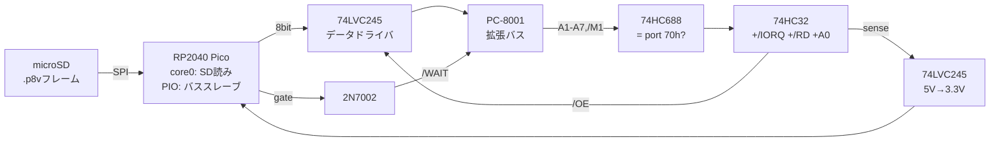

[English](./README.md) · **日本語**

# VSTREAM — 2026年の動画を1979年のPC-8001に流し込む

このrepoで変換した `.p8v` フレームデータをmicroSDから実機PC-8001へ
ストリームする拡張バスアダプタ。本物のμPD3301に表示させる。1979年に
足りなかったのは計算力でも表示能力でもなく**ストレージ帯域**（92秒
＝8.3MB＝フロッピー58枚）。このボードはその47年ぶんの橋。

## 構成



- **読み出し専用I/Oポート1本（70h）** — Z80プレイヤーは `INIR` を回すだけ
- **/WAITによるハードフロー制御**：PicoのFIFOが空ならINサイクルが
  伸びる。ステータスポートもポーリングも不要
- **レベル変換**：74LVC245（5VトレラントIN、3.3V出力はTTL V_IH=2.0Vを
  満たす）— レトロ接続の定石レシピ
- アドレスデコード：74HC688がA1–A7＋/M1を比較（割り込みACK除外）、
  74HC32で/IORQ・/RD・A0と合成 → `/OE`

## Z80プレイヤー（15fps、DMAフリップでダブルバッファ）

```asm
PORT    equ 70h
PAGE0   equ 0C000h          ; 3000バイトのVRAMページ×2
PAGE1   equ 0CC00h
        ; ... CRTC/DMAC初期化はデモと同じ (test-z80.mjs参照) ...
frame:  ld   hl, backpage    ; DMAが読んでいない側のページへ
        ld   d, 12           ; 12 × 250 = 3000バイト
chunk:  ld   b, 250
        ld   c, PORT
        inir                 ; ペースは/WAITが取る
        dec  d
        jr   nz, chunk
        call flipdma         ; OUT 64h/65h: ch2/ch3を新ページへ
        jr   frame
```

見積り：`INIR`＝21ステート/バイト×3000＝63kステート＋α。4MHz Z80で
約16fps、そこからDMA表示の3割減速 → **目標15fps**（オーサリング時に
フレーム複製）。`.p8v`形式：`"P8V1"` + u8 cols + u8 rows + u8 fps +
`rows×(cols+40)`バイトのフレーム列。

## ファイル

- `vstream_netlist.py` — skidlソース（python3.10で実行）
- `vstream.net` — **ERC検証済みKiCadネットリスト**（エラー0）
- `bom.csv` — 部品表

## fabに出すには

1. `kinet2pcb -i vstream.net -w`（またはKiCadでネットリスト読込）
2. pcbnewで配置・配線（freeroutingでも可）。2層で余裕
3. DRC → Gerber出力 → 好きな基板屋へzip

## 正直コーナー

ERC検証済みだが**実機未検証**。J1（拡張コネクタ）のピン番号は
プレースホルダ — レイアウト前にPC-8001サービスマニュアルとの照合必須。
RP2040のPIOプログラムとSDリーダーのファームウェアは未着手（issue #3）。
タイミング余裕（LVC245伝播〜5ns、データ事前ロード）はFIFO充填時
ゼロウェイトのはずだが、オシロで見た者はまだいない。ピン照合の
午後いっぱいを経て、fabに渡せる設計スタディである。
