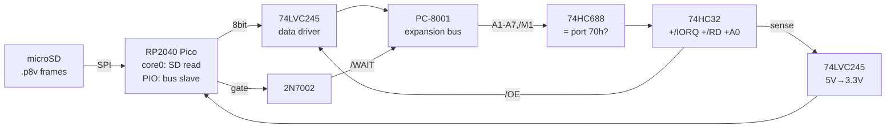

**English** · [日本語](./README.ja.md)

# VSTREAM — feeding 2026 video into a 1979 PC-8001

An expansion-bus adapter that streams `.p8v` frame data (this repo's
converted video) from a microSD card into a real PC-8001, so the actual
μPD3301 displays it. The 1979 bottleneck was never compute or display — it
was storage bandwidth (a 92s clip = 8.3MB = 58 floppies). This board is
that missing 47-year bridge.

## Architecture



- **One read-only I/O port (70h)** — the Z80 player just runs `INIR`.
- **Hardware flow control via /WAIT**: if the Pico's FIFO is empty the IN
  cycle stretches until data is ready. No status port, no polling.
- **Level shifting**: 74LVC245 (5V-tolerant inputs, 3.3V outputs satisfy
  TTL V_IH=2.0V) — the standard retro-interfacing recipe.
- Address decode: 74HC688 compares A1–A7 + /M1 (interrupt-ack excluded),
  qualified with /IORQ, /RD, A0 through 74HC32 → `/OE`.

## Z80 player (15 fps, double-buffered via DMA flip)

```asm
PORT    equ 70h
PAGE0   equ 0C000h          ; two 3000-byte VRAM pages
PAGE1   equ 0CC00h
        ; ... CRTC/DMAC init as in the demo (see test-z80.mjs) ...
frame:  ld   hl, backpage    ; fill the page the DMA is NOT reading
        ld   d, 12           ; 12 x 250 = 3000 bytes
chunk:  ld   b, 250
        ld   c, PORT
        inir                 ; /WAIT paces us — no status polling
        dec  d
        jr   nz, chunk
        call flipdma         ; OUT 64h/65h: point ch2/ch3 at the new page
        jr   frame
```

Budget: `INIR` = 21 T-states/byte × 3000 = 63k T + overhead, ~16 frames/s
on a 4 MHz Z80 **before** the ~30% DMA display steal → target 15 fps with
frames duplicated at authoring time. `.p8v` format: `"P8V1"`, u8 cols, u8
rows, u8 fps, then frames of `rows × (cols + 40)` bytes.

## Files

- `vstream_netlist.py` — skidl source (run with python3.10)
- `vstream.net` — **ERC-checked KiCad netlist** (0 errors)
- `bom.csv` — bill of materials

## To fab

1. `kinet2pcb -i vstream.net -w` (or KiCad: import netlist) → footprints
2. Place & route in pcbnew (or freerouting), 2-layer is plenty
3. DRC → `File > Fabrication Outputs > Gerber` → zip to any board house

## Honesty section

ERC-verified netlist; **not silicon-verified**. J1 (expansion connector)
pin numbers are placeholders — verify against the PC-8001 service manual
before layout. The RP2040 PIO program and the SD reader firmware are not
written yet (issue #3). Timing margins (LVC245 ~5ns prop, preloaded data)
should give zero wait states when the FIFO is full, but nobody has scoped
it. This is a design study you could hand to a fab — after one afternoon
of pinout verification.
